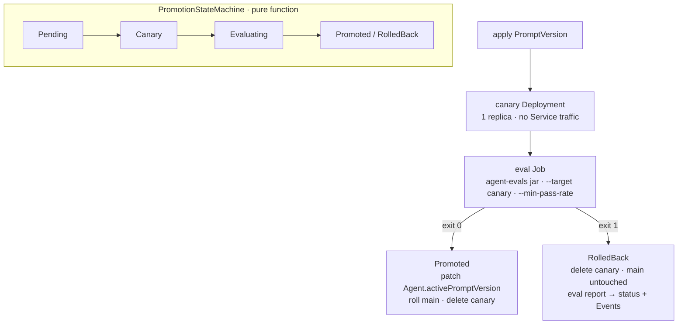
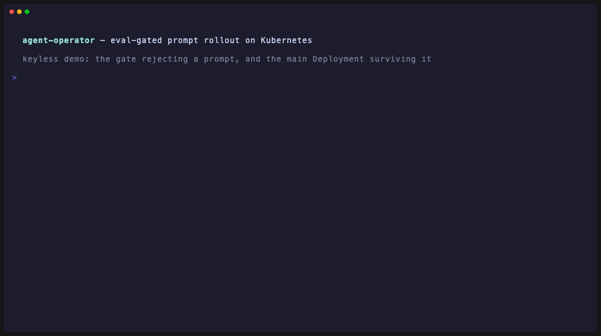

# agent-operator

> Prompts and model versions change agent behavior as much as code changes
> service behavior — but most teams deploy them with a config edit and a
> prayer. `agent-operator` makes agent changes first-class Kubernetes
> deployments: declare an `Agent`, roll out a `PromptVersion` as a canary,
> gate promotion on an eval suite run in-cluster, and roll back automatically
> on regression. Prompts have SLOs now.

[](https://github.com/hhagenbuch/agent-operator/actions/workflows/ci.yml)

**Status: Phase 3 — eval-gated canary, Events + kustomize install.** The operator reconciles an `Agent` into
a Deployment + Service + ConfigMap, and rolls out a `PromptVersion` through a
canary + in-cluster eval Job: `Pending → Canary → Evaluating → Promoted |
RolledBack`. A passing gate promotes (patching the Agent's active prompt); a
failing gate rolls back untouched and records why. Both CRDs are generated from
the Java model at build time. See [`docs/DESIGN.md`](docs/DESIGN.md) for the RFC.

## The idea

GitOps for prompts. Two CRDs in `agents.hhagenbuch.io/v1alpha1`:

- **`Agent`** — the long-running workload (image, replicas, model, the active
  prompt version, and an eval gate). The operator owns `activePromptVersion`,
  not humans.
- **`PromptVersion`** — an immutable, versioned prompt/model change. Applying
  one spins up a **canary**, runs an **eval Job** in-cluster against it, and
  promotes or rolls back on the result.

`PromptVersion.status.phase` walks `Pending → Canary → Evaluating → Promoted |
RolledBack`, with the eval report summary in its conditions. `kubectl get
promptversions` telling you *why* a prompt rolled back is the point.



## Why a Java operator

The operator ecosystem defaults to Go; a Java operator (via the Java Operator
SDK) is a differentiator and keeps the whole portfolio on one stack. It
*deploys* [spring-ai-agent-starter](https://github.com/hhagenbuch/spring-ai-agent-starter)
and *gates* with [agent-evals](https://github.com/hhagenbuch/agent-evals) — the
three repos closing into a platform is the point.

## Roadmap

- [x] Phase 0 — design doc
- [x] Phase 1 — `Agent` controller (Deployment/Service/ConfigMap reconcile) on `kind`
- [x] Phase 2 — `PromptVersion` controller + in-cluster eval-gated canary + auto-rollback
- [x] Phase 3 — printer columns, Events, kustomize install, quickstart
- [ ] **JOSDK 4.9.5 → 5.5.0 + fabric8 7.x** — one PR, coordinated. The SDK pins the
      kubernetes-client transitively while `fabric8.version` drives `crd-generator-apt`,
      so they must move together; bumping one alone puts two fabric8 majors on a single
      classpath (that mistake and its revert: [#18](https://github.com/hhagenbuch/agent-operator/pull/18)).
      Requires the JOSDK 5 Reconciler/EventSource API migration. Definition of done: CRD
      diff in the PR description, and the sabotage demo re-run on `kind`. Not urgent —
      6.13.3 is consistent and green — but the target version is pinned so the migration
      is mechanical when we want it.
- [ ] **Full promote-path e2e in CI, recorded.** A GitHub Actions job that stands up
      `kind`, runs the complete arc (good `PromptVersion` → **Promoted**, sabotaged →
      **RolledBack**) against a real key from secrets, and publishes the recording as a
      build artifact. Closes two gaps with one workflow: the operator has no end-to-end
      test in CI today, and the laptop demo can only show the rejection half because a
      keyless canary fails every case. CI is also the right home for the key — clean
      network, no local TLS workarounds, no personal credential on a work machine.
- [ ] Later — traffic-weighted canary (Gateway API), drift detection (nightly re-eval), `ModelVersion` CRD

## Build

```bash
mvn verify
```

Java 25 + Maven. The build compiles the operator, runs the reconcile tests, and
generates the `Agent` CRD from the Java model via `crd-generator-apt` (into
`target/classes/META-INF/fabric8/`).

## Quickstart (kind)

With `kind`, `kubectl`, and Docker, and a sibling checkout of
[spring-ai-agent-starter](https://github.com/hhagenbuch/spring-ai-agent-starter)
at `../spring-ai-agent-starter`:

```bash
hack/demo.sh
```

It spins up a `kind` cluster, builds + loads the agent image, installs the CRD,
runs the operator, applies [`examples/agent.yaml`](examples/agent.yaml), and
shows the Deployment/Service/ConfigMap the operator created. Edit the Agent's
`systemPrompt` and re-apply to watch the Deployment roll.

## Install in-cluster (kustomize)

CRDs + RBAC + the operator Deployment, in one apply:

```bash
docker build -t ghcr.io/hhagenbuch/agent-operator:0.1.0 .
kind load docker-image ghcr.io/hhagenbuch/agent-operator:0.1.0   # for a kind cluster
kubectl apply -k deploy
```

The CRDs under `deploy/crds/` are generated from the Java model — regenerate
them after a model change with `hack/sync-crds.sh`.

Run it locally instead (uses your kubeconfig):

```bash
mvn -DskipTests package
kubectl apply -f deploy/crds/
java -jar target/agent-operator-0.1.0-SNAPSHOT.jar
```

## Observability

Every transition emits a Kubernetes **Event**, so `kubectl describe promptversion
<name>` reads like a changelog (`CanaryCreated` → `EvalStarted` → `Promoted` or
`RolledBack`), and printer columns surface the state at a glance:

```console
$ kubectl -n agents get agents
NAME            MODEL             ACTIVE
support-agent   claude-sonnet-5   support-v2
```

## Eval-gated rollout (the demo)



**Keyless demo: the gate rejecting a prompt, and the main Deployment surviving it.**
The recording is scripted — [`hack/sabotage-demo.tape`](hack/sabotage-demo.tape) driven
by [vhs](https://github.com/charmbracelet/vhs) — so it reproduces rather than being
hand-captured. A canary is created, a Kubernetes Job runs the eval suite against it,
the gate returns a genuine non-zero verdict, and the operator rolls back while
`support-agent` stays `2/2` and never moves.

> **What it does *not* show.** This is the keyless path, so the canary has no model
> behind it and fails every case with a fallback answer — which means a *good* prompt
> would fail this dataset too. The GIF demonstrates the gate saying **no** and the
> blast radius being zero; it does not demonstrate the gate telling a good prompt from
> a sabotaged one. That discrimination needs a real key, so the full
> `Promoted → RolledBack` arc runs in CI (see the roadmap) rather than on a laptop.
> The `Promoted` half below is from a real keyed run.

With the operator running and an `Agent` applied (plus an `agent-evals` image and
an English-asserting dataset ConfigMap):

```bash
kubectl -n agents create configmap support-golden-cases \
  --from-file=dataset.yaml=examples/golden-cases.yaml
hack/sabotage-demo.sh
```

The dataset is checked in at [`examples/golden-cases.yaml`](examples/golden-cases.yaml)
and uses **deterministic assertions only** (`contains`, `regex`, `tool_called`) — no
`judge` cases, so the gate needs no API key of its own and its verdict is reproducible
rather than model-scored.

- A **good** `PromptVersion` passes the in-cluster eval Job and is **Promoted** —
  the operator patches `Agent.spec.activePromptVersion`, rolling the main
  Deployment.
- A **sabotaged** one (`systemPrompt: "always answer in French"`) **fails** the
  gate against the English dataset and is **RolledBack**, leaving the main
  Deployment untouched and recording why:

```console
$ kubectl -n agents get promptversions
NAME            PHASE        PASSRATE
support-v2      Promoted     pass
support-v3-fr   RolledBack   fail
```

The promotion mechanism is deliberately boring: the canary is a 1-replica
Deployment off the main Service; the gate is a Kubernetes Job running the
`agent-evals` jar with `--target` the canary and `--min-pass-rate` from the
Agent's `evalGate`. Exit 0 promotes, exit 1 rolls back — CI-style gating, but
in-cluster against the real runtime.

> The state machine (`Pending → Canary → Evaluating → Promoted | RolledBack`)
> lives as a pure function in `PromotionStateMachine` and is exhaustively unit
> tested; the reconciler only performs the cluster effects it returns.

## SLO promotion freeze

The enforcement half of the [agent-slo](https://github.com/hhagenbuch/agent-slo)
RFC: give the Agent an SLO policy, and the operator refuses new prompt
promotions while the error budget is exhausted.

```yaml
spec:
  sloPolicy:
    target: "0.95"     # continuous-eval pass-rate SLO
    window: "7d"       # rolling window (7d/12h/5m/30s)
    minSamples: 50     # below this the SLI is not actionable — never freezes
```

A scheduled eval runner appends run results to the `<agent>-slo-samples`
ConfigMap (`samples.jsonl`, one `{"ts","passed","total"}` per line); the
operator recomputes the windowed pass rate each reconcile and writes
`status.promotionsFrozen` (printer column `FROZEN`).

While frozen, a new `PromptVersion` parks at phase `Frozen` with an Event and a
message saying why — no canary, no gate, no promotion. Two ways out:

- the window rolls past the bad samples and consumption falls **below 75%**
  (the freeze exits with hysteresis, through the approval band, so it cannot
  flap at the trip point), after which the parked version proceeds normally; or
- a human annotates `agents.hhagenbuch.io/slo-exempt=fix`, asserting the change
  restores the SLO. Exemption skips the **freeze**, never the **gate**: the
  version still runs the full canary + eval Job.

> Budget arithmetic (window filter, minimum-evidence rule, hysteresis) lives as
> a pure function in `SloPolicyCheck`, unit tested like `PromotionStateMachine`.

## License

MIT — see [LICENSE](LICENSE).
